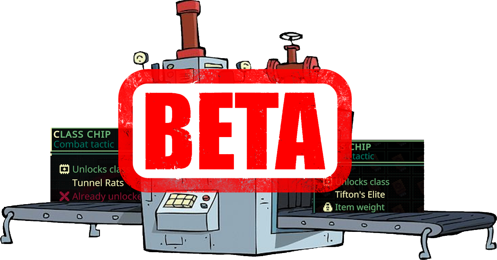

# Quasimorph Pity Unlock

Tired of only getting chips for mercenaries and classes that have already been unlocked?

This mod adds a "pity" system which increases the chances of getting a class/merc that has not been unlocked.  The game's random class and merc spawn is still used for non "pity" rolls.

**Terms:** For simplicity, this doc may refer to "unlocked" mercs and classes as "discovered", and class and merc chips as "chips"

## Defaults
By default, the mod guarantees that if a chip that is already discovered is spawned, the next spawn will be one that is not discovered.

Use the "Always" mode in the configuration file to change the rolls to always spawn a chip that is not discovered.

See the [configuration](#configuration) section below.

# Credits
The "Always" mode is similar to functionality that is part of WarStalkeR's "Fight For Universe: Phase Shift" mod.  The ability to change the outcome of spawn rolls is his idea and replicated with permission.

# Spawning vs Finding
A chip spawned by a pity roll only guarantees that an undiscovered chip will spawn.  The player must still find the chip in the mission.

The pity roll only checks if the player *currently* has discovered the chip.  Therefore, it is possible to get the same undiscovered chips for mission spawns and station rewards.  Even if the player has the chip in inventory and is locked.

Anytime an undiscovered chip is spawned, the pity roll counter is reset.

# Configuration

The configuration file will be created on the first game run and can be found at `%AppData%\..\LocalLow\Magnum Scriptum Ltd\Quasimorph\QM_PityUnlock\config.json`.

|Name|Default|Description|
|--|--|--|
|Mode|Hard|Determines the pity algorithm to use. See the [Pity Modes](#pity-modes) section below.|
|HardPityCount|1|Hard mode only setting.  The number of "failed" rolls before next roll is guaranteed to be undiscovered.|
|PercentageMultiplier|.1|Percentage mode only setting.  The multiplier for the increased chance of a pity roll, per duplicate roll. Ex: .1 is +10% per duplicate roll.|

## Pity Modes

There are multiple modes for how the "pity" system works.

|Mode|Description|
|--|--|
|Always|Every spawned chip will be types that have not been discovered.|
|Hard|Every X times an already discovered item is spawned, the next spawn is guaranteed to be undiscovered.|
|Percentage|Increases chance of an undiscovered chip to spawn based on how many duplicates have been rolled. For example, if set to .10, three duplicate rolls would cause the next roll to have a 30% chance to spawn an item that is not discovered.|

# Support
If you enjoy my mods and want to buy me a coffee, check out my [Ko-Fi](https://ko-fi.com/nbkredspy71915) page.
Thanks!

# Source Code
Source code is available on GitHub at https://github.com/NBKRedSpy/QM_PityUnlock
