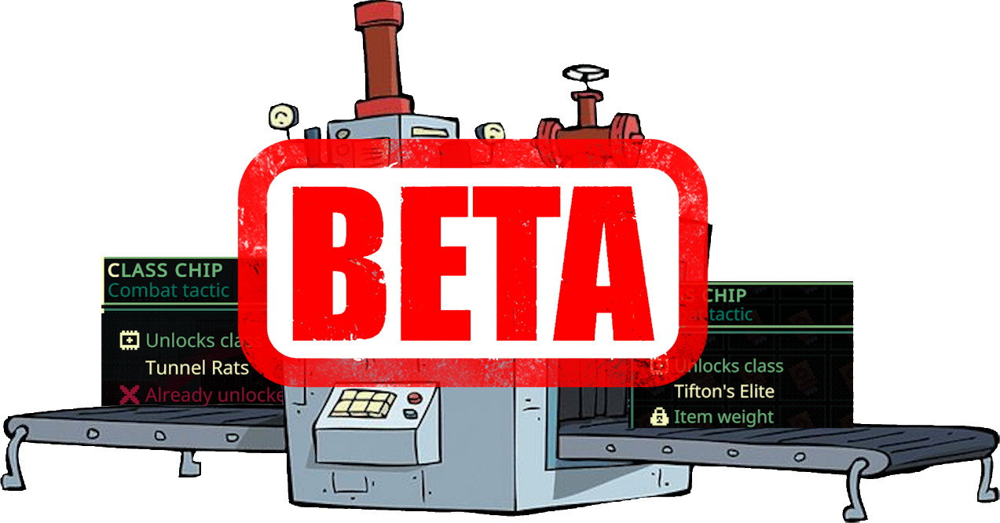

# Quasimorph Pity Unlock!

Tired of only getting chips for mercenaries, classes, or production items that have already been unlocked?  This mod adds a "pity" system where the user has an increased chance to get a chip that will unlock something new.  

The default config of this mod will always roll a "locked" chip after each already "unlocked" chip of that type was found.  

There are multiple options to tailor the pity roll conditions to taste.  The settings are found in the Main Menu -> Mods -> Pity Unlock.  Hover over the setting name on the left to see the setting's description.

See the [Configuration](#configuration) section below for more information on the settings.

# Mod Compatibility
If a mod doesn't use saves (such as "The Dive"), then the Pity rolls will be disabled.  When a normal save is loaded, functionality will resume.

# I See Dupe Chips Even With Always Mode!
This mod works by changing the results of the game's rolls for chip unlocks.  The rolls occur when the chips are *created* by the game, not when bought or picked up.  This can cause the player to possibly get the same locked chips since they didn't have them when the chips were rolled.

Chips are created at these times:
* When a mission is started, all chips are generated for that mission.
* When stations refresh their inventory.  
* When a user buys more than one chip of the same type at the same station, the chips beyond the first are generated.

I would like to change this to be at purchase or pickup, but this is currently a low priority.  The GitHub source is linked below if anyone would like to contribute.

# Glossary
|Term|Description|
|--|--|
|Pity Roll|A 100% chance of spawning an undiscovered item.  Replaces a single, random spawn chance every time the pity threshold is reached.|
|Chip|Class, merc, or production item chips|
|Discovered|Chips that have already been unlocked.|

# Spawning and Finding
The pity rolls occur at the time of a chip spawn, and the chips are chosen from the list of undiscovered chips at that point in time.  Therefore, it is possible for chips from pity rolls to occur multiple times in a mission or from station rewards.  

The player must still find chips from pity rolls as normal.

Anytime an undiscovered chip is spawned, the pity roll counter is reset.

# Configuration

## Example Configurations:
* Every roll guarantees an undiscovered chip.
* After X discovered chip rolls in a row.  Ex: 5 means that after 5 discovered rolls in a row, a pity roll will occur.
* For every discovered chip roll, adds an X% increased chance of a pity roll.  Ex: .1 means that after three discovered rolls, there is a 30% chance of a pity roll.

## Pity Options
The configuration file will be created on the first game run and can be found at `%AppData%\..\LocalLow\Magnum Scriptum Ltd\Quasimorph_ModConfigs\QM_PityUnlock\config.json`.

|Name|Default Value|Description|
|--|--|--|
|Mode|Hard|Determines the pity algorithm to use. See the [Pity Modes](#pity-modes) section below.|
|HardPityCount|1|Hard mode only setting.  The number of discovered rolls in a row before next roll is a pity roll.|
|PercentageMultiplier|.1|Percentage mode only setting.  The multiplier for the increased chance of a pity roll.  Ex: .1 is +10% per discovered roll.|

## Pity Modes

|Mode|Description|
|--|--|
|Always|Every spawned chip will be undiscovered.|
|Hard|Every X times in a row that an already discovered item is spawned, the next spawn is guaranteed to be undiscovered.|
|Percentage|An increasing chance of a pity roll per discovered chip roll.  For example, if set to .10, three discovered chip rolls in a row would cause the next roll to have a 30% chance to spawn an item that is not discovered.|

# Diagnostics

As per the mod's documentation, the chip is chosen when the chip is created, not when the user finds or unlocks the chip. It is expected that sometimes  exact same unlocked chip will be found twice in a raid or at stations.

The first step is to do a Steam File Verification to force the mods to update.  

If the mod appears to not be working, the testing steps can be found at https://github.com/NBKRedSpy/QM_PityUnlock/blob/main/Testing.md .

# Credits

Huge thanks to Crynano for their Mod Configuration Menu which adds the mod configuration screen.

The "Always" mode is similar to functionality that is part of WarStalkeR's "Fight For Universe: Phase Shift" mod. The ability to change the outcome of spawn rolls is his idea and replicated with permission.

# Support
If you enjoy my mods and want to buy me a coffee, check out my [Ko-Fi](https://ko-fi.com/nbkredspy71915) page.
Thanks!

# Source Code
Source code is available on GitHub at https://github.com/NBKRedSpy/QM_PityUnlock

# Change Log
https://github.com/NBKRedSpy/QM_PityUnlock/blob/main/CHANGELOG.md

