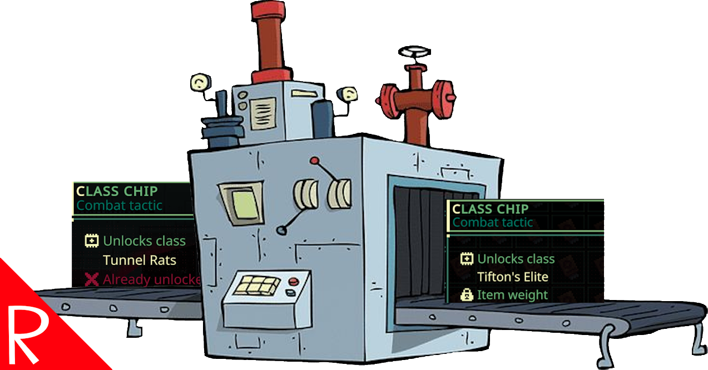

# Quasimorph QM_PityUnlock

Tired of only getting chips for mercenaries and class that have already been unlocked?

This mod adds a "pity" system which increases the chances of getting a class/merc that has not been unlocked.
It also has a mode to always drop merc/class chips that the player has not unlocked.

By default, the mod guarantees that if an already unlocked class/merc is spawned, the next spawn will be one that is not unlocked.
Use the "Always" mode in the configuration file to ensure every spawn is not unlocked.

See the [configuration](#configuration) section below.

# Credits
The "Always" mode is similar to functionality that is part of WarStalkeR's "Fight For Universe: Phase Shift".

# Spawning vs Finding

A pity roll only guarantees that an item that is not unlocked will spawn.  The user must still find the chip just like any chip.

# Configuration

The configuration file will be created on the first game run and can be found at `%AppData%\..\LocalLow\Magnum Scriptum Ltd\Quasimorph\QM_PityUnlock\config.json`.

|Name|Default|Description|
|--|--|--|
|Mode|Hard|Determines the pity algorithm to use. See the [Pity Modes](#pity-modes) section below|
|HardPityCount|1|Hard mode setting.  The number of "failed" rolls before a roll is guaranteed to not be unlocked|
|PercentageMultiplier|.1|Percentage mode setting.  The increased chance for a pity roll for each dupe roll.|

## Pity Modes

There are several options for how the "pity" system works.

|Mode|Description|
|--|--|
|Always|Every spawned merc/class chip will types that have not been unlocked.|
|Hard|Every X times an already unlocked item is spawned, the spawn is guaranteed to not be unlocked|
|Percentage|Increases chance of not unlocked spawn based on how many dupes have been rolled. For example, if set to .10, three duplicate rolls would cause the next roll to have a 30% chance to spawn item that is not unlocked|

# Support
If you enjoy my mods and want to buy me a coffee, check out my [Ko-Fi](https://ko-fi.com/nbkredspy71915) page.
Thanks!

# Source Code
Source code is available on GitHub at https://github.com/NBKRedSpy/QM_PityUnlock
